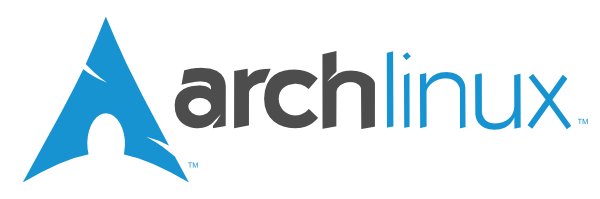

= Dotfiles

== Purpose

- To keep all my configuration files under version control

== Setup

#TODO: This section is under construction

Clone the repo

----
git clone https://github.com/rhc/dotfiles.git
----

Link the dotfiles

----
rake link
----

Install the dependencies

----
rake pacman
----

Bootstrap 

----
rake bootstrap:vim
----

== My list of applications

// 

// image:images/vim_on_fire.gif[height=192]
image:images/vim-logo.png[height=192]
image:images/asciidoc-logo.png[height=96]
image:images/git-logo.png[height=128]
image:images/mozilla-firefox-logo.png[height=128]

image:images/ruby-logo.png[height=128]

image:images/rbenv-logo.png[height=64]
image:images/bootstrap-logo.png[height=64]
// image:images/haml-logo.png[height=64]

image:images/openssh-logo.png[height=64]

image:images/anki-logo.png[height=64,title="Anki"]
image:images/vlc-logo.png[height=48,title="VLC"]

image:images/gimp-logo.jpg[height=48,title="GIMP"]

image:images/virtualbox-logo.png[title="Oracle Virtual Box", height=48]

=== Selection  criteria

This is the list of programs I use to get things done quickly.
Like my good friend http://kmandla.wordpress.com/software/[Mandla], 
I tend to select programs that:   

. Do one thing, and only one thing
. Do that one thing well and fast
. Don’t drag my system down
. Do it in style

I prefer CLI over GUI. 
I like to enable Vim keybindings accross all programs. 

You can find below my programs loosely grouped in the following categories: 
Internet,
Multimedia,
Utilities,
Documents,
Security and
Science. 

=== Internet

- Network manager: netcl
- Web browser: firefox, chrome
- Add-ons web browser: pentadactyl, todoist
- Youtube downloader: youtube-dl
- Bit torrent client: transmission
- Email client: gmail
- Instant messaging: pidgin ?, 
- IRC client: irssi
- Tunneling reverse proxy: ngrok

- Text editor: Vim 
- Display manager: XMonad
- Task manager: Todoist, Task
- Screen saver: xscreensaver 
- Softphone: skype, hangout 
- News aggregator: newsbeuter ?
- Blog: jekyll ?
- Twitter client: ?
- Pastebin client: gist
- Bitcoin: 

=== Multimedia

- Image viewer: feh
- Raster editor: gimp, imagemagick
- Vector graphics: dia, inkscape, 
- 3D modeling/rendering: blender
- Screen capture: scrot
- Audio player: mpd, cmus
- Video player: vlc
- Volume manager: ?
- CD ripping: ?
- Sound editing: 
- Mobile phone manager: gnokii
- Video editor:
- Screencast: ?
- Collection manager: xbmc
- Graph visualization: graphviz

=== Development

- programming language: ruby
- Web framework: rails
- Ruby version management: rbenv
- Version control system: git
- CSS front-end framework: bootstrap
- Source file indexer: ctags
- Headless Webkit: phantomjs

=== Utilities

- Partition tools:
- Shell: bash, zsh (oneday?)
- Terminal emulator: urxvt, Termite (oneday?), tilda
- Comparison: vimdiff
- Disk usage: filelight ?, ncdu ? 
- Clock synchronization: ntpd
- System monitoring: conky?, htop, 
- System information viewer: alsi?, 
- Clipboard manager: xclip
- Wallpaper setter: feh
- Package management: pacman, packer 
- Terminal multiplexer: tmux
- Window manager: xmonad
- application launcher: dmenu
- finance: gnucash ?, ledger ?
- Time management: taskwarrior, wyrd (oneday)
- Login manager: slim, gdm

=== Documents

- Office suite: libreoffice, google docs
- Document markup language: asciidoc, pandoc
- Spreadsheets: libreoffice calc
- Scientific documents: latex
- Text editor: vim 
- E-book reader: calibre
- Pdf/Djvu/postscript/comicbook viewer: zathura
- Comic book viewer: zathura, mcomix?, qcomicBook ?
- Terminal pagers: less, vimpager
- Chm: chmsee
- OCR software: ?
- Note taking organizers: org-mode ? 
- Flash card: Anki

=== Security

- Security scanner: nmap
- Network intrusion prevention and detection system: snort
- Network protocol analyzer: wireshark
- Vulnerability scanner: nessus
- Intrusion detection system: tripwire
- Backup program: #TODO
- Screen locker: xscreensaver
- Hash checker: md5sum
- Encryption: gnupg, pgp ? 
- Router simulator: gns

=== System 

- Operating system: Arch Linux
- Virtual server: virtualbox
- System and service manager: systemd
- Job scheduler: systemd/cron
- Self-monitoring, analysis and reporting: smartmontools

=== Science

- Calculator: bc
- Numerical computation: octave?
- Statistic: R
- Data evaluation: gnuplot

== To do

- Extend the dotfiles for other applications.
- Create a Rake script for the creation of the symlinks.

// Exclude ./task from the git repository

